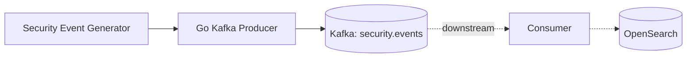

# Sentinel Producer

[](https://github.com/Mach1r0/sentinel-producer/actions/workflows/ci.yml)

A security-event generator and Kafka producer written in Go. Sentinel Producer creates realistic authentication and process-execution events, serializes them as JSON, and publishes them to Kafka using batching, retries, and deterministic partitioning.

This repository implements the producer side of a security-event ingestion pipeline:



## Features

- Generates `auth_failed` and `process_created` security events.
- Produces plausible hosts, users, processes, timestamps, and severities.
- Publishes JSON messages with [`segmentio/kafka-go`](https://github.com/segmentio/kafka-go).
- Uses `source_ip` as the Kafka message key to preserve per-host ordering.
- Buffers messages into configurable batches.
- Retries failed writes with bounded backoff.
- Waits for pending messages during graceful shutdown.
- Emits structured JSON logs and a final delivery-metrics summary.
- Tracks published events, failures, batches, and Kafka retries.
- Supports environment variables with command-line flag overrides.
- Validates broker, topic, event rate, batch size, and source configuration.
- Includes unit tests, race detection, static analysis, and a real Kafka integration test.
- Runs locally with Kafka in KRaft mode through Docker Compose.

## Event schema

Every Kafka message follows this JSON structure:

```json
{
  "timestamp": "2026-08-05T15:32:10Z",
  "event_type": "auth_failed",
  "source_ip": "10.0.0.12",
  "severity": "high",
  "raw": {
    "user": "admin",
    "attempts": 5,
    "reason": "invalid credentials"
  }
}
```

| Field | Type | Description |
| --- | --- | --- |
| `timestamp` | RFC 3339 timestamp | Time at which the event was generated |
| `event_type` | String | Event category, such as `auth_failed` or `process_created` |
| `source_ip` | IP address | Simulated host that originated the event |
| `severity` | String | Event severity: `low`, `medium`, or `high` |
| `raw` | JSON object | Event-specific attributes |

## Design decisions

### Partitioning by source IP

The producer sets the Kafka message key to `source_ip` and uses a hash balancer. Events generated by the same host therefore reach the same partition, preserving their relative order. This is useful for sequence-based detections such as repeated authentication failures from one source.

### Batching and delivery

The Kafka writer buffers messages until the configured batch size or batch timeout is reached. It requires acknowledgements from all in-sync replicas and retries failed writes with bounded backoff. Delivery errors are reported through the asynchronous completion callback.

When the process receives `SIGINT` or `SIGTERM`, it stops generating events and closes the Kafka writer. Closing the writer waits for buffered messages to finish before the application exits.

## Requirements

- Go 1.26 or later
- Docker
- Docker Compose

## Quick start

From the repository root, start Kafka and the producer:

```bash
docker compose -f Docker/docker-compose.yml --profile app up --build
```

The Compose stack:

1. Starts a single-node Kafka broker in KRaft mode.
2. Waits for Kafka to become healthy.
3. Creates the `security.events` topic with three partitions.
4. Builds and starts Sentinel Producer.

Stop the stack with:

```bash
docker compose -f Docker/docker-compose.yml --profile app down
```

## Inspect produced events

With the stack running, open another terminal:

```bash
docker compose -f Docker/docker-compose.yml exec kafka \
  /opt/kafka/bin/kafka-console-consumer.sh \
  --bootstrap-server kafka:29092 \
  --topic security.events \
  --from-beginning
```

Press `Ctrl+C` to stop the console consumer.

## Run locally

Start only Kafka:

```bash
docker compose -f Docker/docker-compose.yml up -d kafka kafka-init
```

Run the Go producer on the host:

```bash
go run ./cmd/producer \
  -broker localhost:9092 \
  -topic security.events \
  -rate 10 \
  -batch-size 50 \
  -source simulated
```

## Configuration

Command-line flags take precedence over environment variables.

| Flag | Environment variable | Default | Description |
| --- | --- | --- | --- |
| `-broker` | `KAFKA_BROKER` | `localhost:9092` | Kafka bootstrap broker |
| `-topic` | `KAFKA_TOPIC` | `security.events` | Destination topic |
| `-rate` | `EVENT_RATE` | `10` | Events generated per second |
| `-batch-size` | `KAFKA_BATCH_SIZE` | `50` | Target number of messages in a batch |
| `-source` | `EVENT_SOURCE` | `simulated` | Event source; currently only `simulated` is supported |

For example:

```bash
KAFKA_BROKER=localhost:9092 \
EVENT_RATE=25 \
KAFKA_BATCH_SIZE=100 \
go run ./cmd/producer
```

## Tests

Run the unit tests:

```bash
go test ./...
```

Run tests with the race detector and coverage:

```bash
go test -race -cover ./...
```

Run static analysis:

```bash
go vet ./...
```

The integration test creates an isolated Kafka topic, publishes an event, closes the producer to flush its batch, consumes the event, validates it, and removes the topic.

Start Kafka before running it:

```bash
docker compose -f Docker/docker-compose.yml up -d kafka kafka-init
go test -race -cover -tags=integration ./...
```

Tests without the `integration` build tag do not require Kafka.
The GitHub Actions workflow runs both the isolated unit suite and the Kafka integration suite.

## Project structure

```text
.
├── cmd/
│   └── producer/
│       ├── main.go
│       └── main_test.go
├── internal/
│   ├── event/
│   │   ├── generator.go
│   │   ├── generator_test.go
│   │   └── schema.go
│   └── kafka/
│       ├── metrics.go
│       ├── producer.go
│       ├── producer_test.go
│       └── producer_integration_test.go
├── Docker/
│   ├── Dockerfile
│   └── docker-compose.yml
├── .github/
│   └── workflows/
│       └── ci.yml
├── go.mod
├── go.sum
└── README.md
```

## Current scope

Sentinel Producer is intentionally focused on event generation and reliable Kafka publication. Kafka consumption, indexing, search, and visualization belong to the downstream portion of the pipeline and can be developed and deployed independently.
